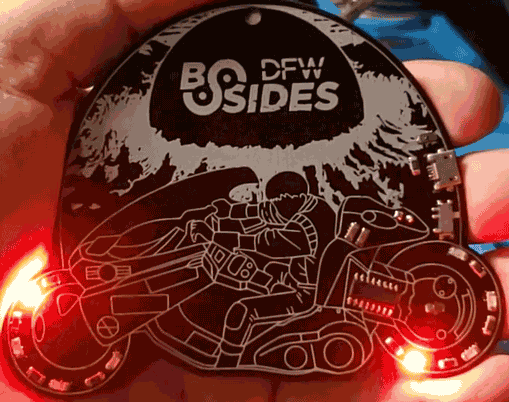
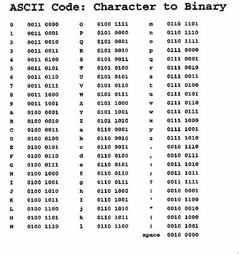
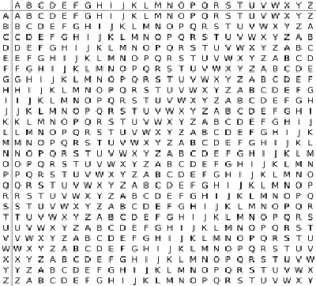

# AKIRA Badge Crypto Challenge

The AKIRA Badge included a cryptography challenge that was designed to be solved during the one day BSidesDFW 2019 conference.  

Here is registered winner and the list of those who solved it during the BSidesDFW conference:

| Timestamp	| Name/Handle |
| --------- | --------- |
| 11/2/2019 09:42:15	| Malcolm @leetnet - WINNER |
| 11/2/2019 10:26:40	| jeff morales |
| 11/2/2019 11:34:17	| @hkhanes |
| 11/2/2019 11:34:28	| hiccup |
| 11/2/2019 11:34:39	| @mcwtravis |
| 11/2/2019 14:02:52	| monopole |
| 11/2/2019 14:12:15	| zarak |
| 11/2/2019 14:18:32	| Wheatley |
| 11/2/2019 14:33:49	| M0r1 |
| 11/2/2019 14:34:54	| Lowkey |
| 11/2/2019 14:35:42	| Aggie_r3c0n |
| 11/2/2019 15:19:55	| Spdrstar |
| 11/2/2019 17:31:32	| 17:31 |

Thanks to all who participated in this challenge!

Since this was the first cryptography challenge I designed, I am very happy that so many people enjoyed it and solved it.

For those who have not yet solved it yet: Spoiler Alert!  
I am going to walk through all the details of the challenge including the solution on this page.
If you are wanting to solve this challenge on your own then [TURN BACK NOW!](/)

-- [@alt_bier](https://twitter.com/alt_bier)

---


# Crypto Challenge Details

## Concept

The idea of adding a crypto challenge to the badge was one that I came up with early in badge design.
This is why the badge has eight LEDs on it instead of six or ten, eight was what I wanted for the crypto challenge.

I had never done a crypto challenge before and this seemed like the perfect opportunity.
Since BSidesDFW is a one day conference the challenge would have to be simple enough for people to solve with only part time effort in one day.  
A simple challenge would be easier for me to implement, which was perfect for a first time.

I wanted to tie the challenge to the local DFW hacker community as well as to he theme of the badge which was based on the Akira anime.
You will see both these tie in's as we step through the challenge details.

## Details

Let's get into the details!

### Flashing LED Code

Let's start with the entry to the crypto challenge which is the flashing LED code that was included in the firmware on the badge.

Here is how it to get access to the special crypto challenge LED mode:
* The badges were provided to people with the LED's flashing in a circular pattern to simulate motion.
* There is a button on one of the wheels that changes the LED flashing mode.
* The first few button pushes simply slow down the LED movement.
* The fourth button push will place the badge into crypto challenge LED mode

So, now instead of LED's flashing in a circular pattern they are flashing a code.
* Most people recorded these flashed code from the badge itself to solve what they were.
* Some people found it easier to look up the firmware code in this repository to document the flashed code.

What is this code?

As stated previously, there are a total of eight LED's on the badge.
This is important because there are 8 bits to a byte, and bytes can be characters.
Specifically, ASCII characters.

The code that is being flashed on the LEDs is the binary equivalent of ASCII characters.
The LEDs when read from left to right around each tire will be ON for 1 and OFF for 0.
There is an all off period between each ASCII character being flashed with a longer all off period at the end of message before it repeats.

When compared to an ASCII to Binary table like the one shown below the code will reveal the following cipher text:
```
cbggto.kszraliuge.mwd
```



### CIPHER

Once the the string of cipher text ```cbggto.kszraliuge.mwd``` is found the tasks of determining the Cipher and Key remain to be solved.
Let's focus on the Cipher first.

This is where I included a tie in to the local DFW hacker community.

At a recent [Dallas Hackers Association - DHA](https://dallashackers.com/) meeting one of our communities awesome contributors [Woody @woody2237](https://twitter.com/woody2237) gave a talk about the [Vigenère cipher](https://en.wikipedia.org/wiki/Vigen%C3%A8re_cipher) and a python program he wrote to encrypt/decrypt text using it.

So, the [Vigenère cipher](https://en.wikipedia.org/wiki/Vigen%C3%A8re_cipher) is what I decided to use for this challenge.
To make it a little easier for people to figure out during the conference, I posted a printout of the Vigenère square cipher table (shown below) on a wall in the Hardware Hacking Village with no explanation.  
The few people who asked me about it were given no further clues until the talk at 13:30 where I revealed the name of the Cipher to all who attended.



One resource that I found handy when making this challenge is the [decode.fr Vigenere cipher page](https://www.dcode.fr/vigenere-cipher).  
There are other resources like this one out there, but this is the one I used.

One important note about the cipher is that it was traditionally used with only the 26 letters of the alphabet.
This means that it is not cap sensitive and that any punctuation (periods) should be considered clear text.

### KEY

With both the cipher text and the cipher only the key remains to be solved.

This is where I included a tie in to the badge theme.

Anyone who looked at this badge would know the theme was the Akira anime.
So, to keep the challenge simple I made the key ```AKIRA``` (not cap sensitive).

Using the [Vigenère cipher](https://en.wikipedia.org/wiki/Vigen%C3%A8re_cipher) with the key ```AKIRA``` on the cipher text ```cbggto.kszraliuge.mwd``` (ignoring periods) produces the following clear text:
```
crypto.akirabadge.com
```

This is obviously a web page that the solvers will register for the win, right?

Not so fast!

### Challenge Part II

In order to prevent someone from stealing the win by getting to the solution page by other means than solving cryptography (e.g. whois/dns-lookups/etc.) I added a second part to the challenge.

This second part would have challenge participants solve a second cipher text that is provided on this page.

This next part was designed to be a very easy stop over for those who completed the first part to make it to the web page, since they would already know the cipher and the theme of the first key.

However, anyone who reached this page without solving the first part would have a difficult time since they would not know they cipher or what the first key was based on.

Here is the text from that part one solution page:

```
Congratulations!
If you are here it means that you solved the first part of the crypto challenge.
  To complete the challenge you only need to solve one more puzzle.
  This next puzzle will lead you to another web page in this domain (e.g. crypto.akirabadge.com/something/something.html).
  Note: punctuation has been purposely left out of the ciphertext. So, you will need to figure out if it is /aaa/bbb.html or /aa/ab/bb.html, etc.
  If you got to this page then you already know the cipher used for this next part. You just need to figure out the key.
  I hope you solve this as quickly as Akira drove his bike through the streets of NeoTokyo!
Challenge Part Two
  Here is the ciphertext for part two of the challenge:
  mbnmqdoxuxpl

```

This explains the cipher is the same and this is the new cipher text:
```
mbnmqdoxuxpl
```

This is provided without punctuation, but when solved will send users to another page on this site where the solvers will register for the win.

### Part II KEY

In addition to providing the cipher text that web page provided a major clue as to the key.

This line in particular was the clue:
```
I hope you solve this as quickly as Akira drove his bike through the streets of NeoTokyo!
```

Anyone who has seen Akira or googled it as part of the challenge should know that it was Kaneda and not Akira who rode that infamous bike.

So, the key is ```KANEDA```

Using the [Vigenère cipher](https://en.wikipedia.org/wiki/Vigen%C3%A8re_cipher) with the key ```KANEDA``` on the cipher text ```mbnmqdoxuxpl``` produces the following clear text:
```
cbaindexhtml
```

I kept it fairly simple to figure out where the punctuation should be added turning the clear text ```cbaindexhtml``` into the URI ```/cba/index.html```

This would make the full URL of the solution page:
```
crypto.akirabadge.com/cba/index.html
```


### Solution Page

The final solution page had the following text:
```
Congratulations!
If you are here it means that you solved the crypto challenge, or cheated.

Either way, congratulations!

Register for the Trophy
```

This final solution page then contained an embedded google form for solvers to enter their Name/Handle.
This was saved with the date/time that it was posted.
This form and it's timestamps are what was used to determine the winner.


## Thanks!

Thanks again to all who attempted this challenge.

I hope it was as much fun for you to puzzle and solve as it was for me to create.

-- [@alt_bier](https://twitter.com/alt_bier)
