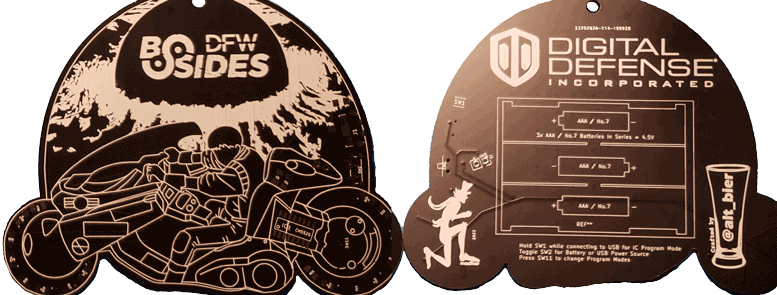

# AKIRA Badge

Welcome to the AKIRA Badge website.

Home to all the information related to the BSidesDFW 2019 AKIRA Badge.  
This includes code and art and cad and fab files.  All the things.

This is also where you will find resources and examples for working with the CH552G micro-controller that is at the heart of this badge.

Please allow me to be your guide.

-- [@alt_bier](https://twitter.com/alt_bier)  - [My Contact Info](https://gowen.net/about)

---

# Badge Details

## Concept

When @0isac0 brought up the idea of an AKIRA themed badge with something to do with that infamous bike I loved it.
He wanted to do a theme related to a movie set in 2019 and I had just made a Blade Runner themed badge for DC27.
So, AKIRA was the next logical choice.

We were originally toying with the idea of having the bike viewed tail on so that we could showcase the back of Kaneda's jacket.
But then I had the idea of using LEDs on the tires to give the illusion that the bike was in motion.

I also wanted to get some of the darker themes of the movie into the badge.
So, having Kaneda be driving his bike past the destruction of Neo-Tokyo seemed like the perfect fit.

I managed to get the explosion artwork and the bike outline completed when I hit a snag.
While I can do technical drawings, I just can't draw people and was really struggling with Kaneda on the bike.
Luckily, @unspecific came to the rescue with some awesome artwork to complete the badge.

## CH552G Micro-Controller

The CH552G is the inexpensive micro-controller that is at the heart of this badge.
It has been highlighted on [Hackaday](https://hackaday.com/tag/ch552/) and elsewhere as a great option for hardware projects.

However, when designing this badge I found there were limited resources available online for this chip as opposed to other more popular and expensive chips.
So, hopefully this repository can help future users of this great micro-controller.

## Surface Mount Components

While I have toyed with surface mount components in several projects, this is the first badge I have designed using them.
This was a challenge that I enjoyed tackling.
However, it did pose one major problem: soldering.

While my little hot air solder gun works fine to reflow SMD's on a project PCB here or there, it does not scale to hundreds.

Luckily, @leetnet was kind enough to loan me an industrial reflow oven.
This let us reflow the badges in the larger quantities needed.

And by us, I mean all the great volunteers (human pick and place machines) who came out to the badge assembly parties.
We would not have been able to get it done without you!

## Lanyard

When designing the lanyard I wanted it to tie into the badge theme as well.
So, where the change to bike profile on the badge didn't let us incorporate the back of Kaneda's jacket, that iconic pill shape worked into the lanyard nicely.

## LED Colors

When coming up with the black and white design it was decided that we would use colored LEDs to bring it to life.
Choosing the right colors involved a lot of trial and error.
But, eventually I settled on four major colors that looked great on it: Red, Green, Yellow, and Blue.

I could not settle on a single color that I liked best.
So, I decided to use them all and make LED color the differentiation between the different badge types: Attendee (Human) - Red, Sponsor - Green, Speaker - Yellow, and Staff - Blue.

## Crypto Challenge

The AKIRA Badge includes a cryptography challenge that will not be detailed here until after the conference is over and the winner is announced.
Be assured that the firmware code and other files included here will not provide any hints to solving this challenge.

There will be a talk about the Crypto Challenge in the BSidesDFW Hardware Hacking Village at 1:30PM where either the winner will be revealed followed by a detailed explanation of challenge, or if it still unsolved a major hint will be dropped.

## Sponsor

I wanted to thank this years badge sponsor [Digital Defense Incorporated](https://www.digitaldefense.com/) for their generous sponsorship that made this years badge possible.

